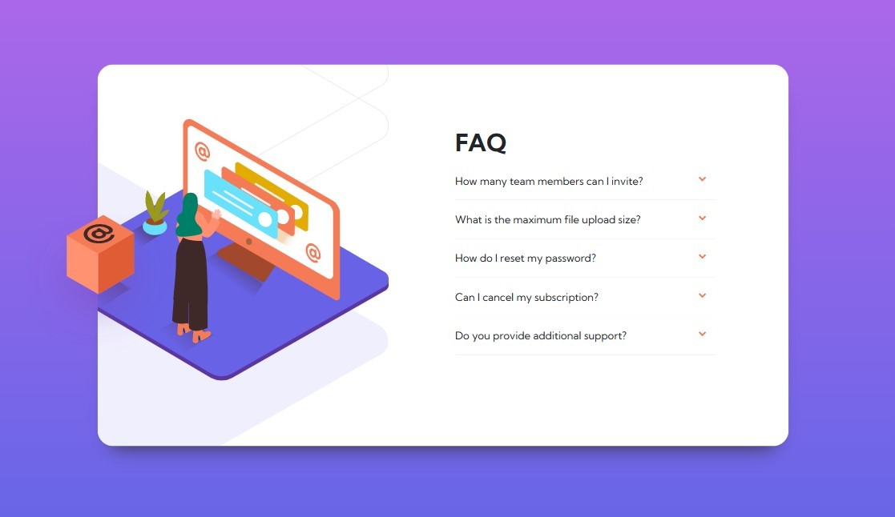

# Frontend Mentor - FAQ accordion card solution

This is a solution to the [FAQ accordion card challenge on Frontend Mentor](https://www.frontendmentor.io/challenges/faq-accordion-card-XlyjD0Oam). Frontend Mentor challenges help you improve your coding skills by building realistic projects. 

### The challenge
- Position the images
- Matching the letter-spacing and line-height
- I do not have access to the Figma sketch so the design is not pixel perfect.
### Screenshot

### Links

- Solution URL: https://www.frontendmentor.io/solutions/faq-accordion-card-XYIoeDwM9Y
- Live Site URL: https://5leepy-faq-accordio-card.netlify.app/

### Built with

- Semantic HTML5 markup
- SCSS
- SCSS Variables
- CSS Grid
- Flex-box
- Mobile-first workflow
- Bootstrap
### Useful resources

- https://www.joshwcomeau.com/css/custom-css-reset/ - This helped me to reset my css. I really liked this pattern and will use it going forward.
- https://css-tricks.com/snippets/css/complete-guide-grid/ - This is an amazing article which helped me finally understand CSS Grid. I'd recommend it to anyone still learning this concept.
- https://www.youtube.com/watch?v=jfMHA8SqUL4&t=6s&ab_channel=CoderCoder - This Helped me to understand css and scss 

## Author

- Nadir Nahdi
- Frontend Mentor - [@5leepy] https://www.frontendmentor.io/profile/5leepy
- Twitter - [@NadirNahdi] https://twitter.com/NadirNahdi

## Acknowledgments

https://www.youtube.com/@TheCoderCoder 

https://www.youtube.com/@KevinPowell

https://www.frontendmentor.io/profile/MelvinAguilar
